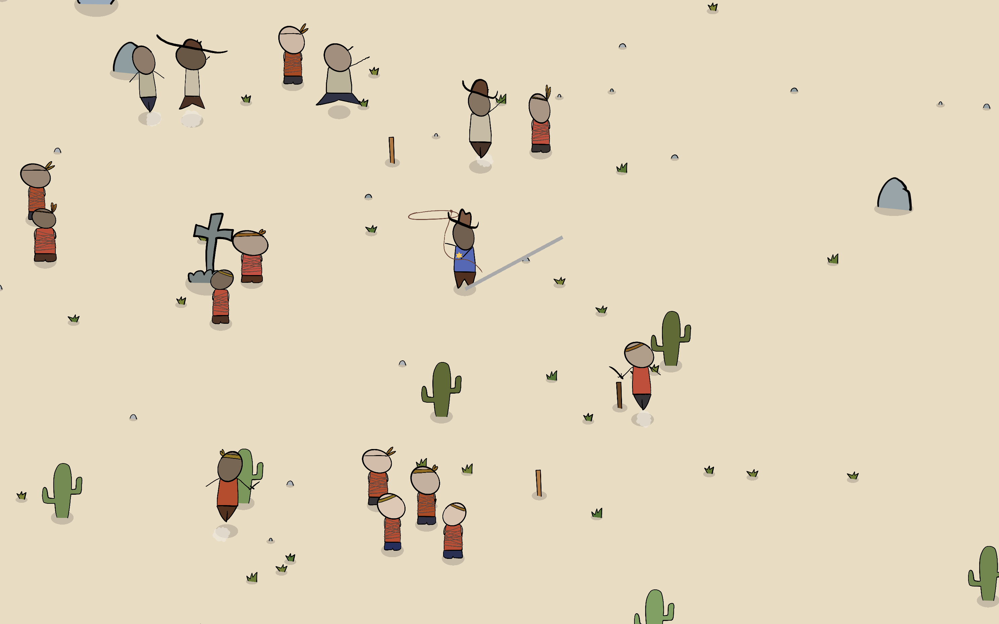

# Lasso Sheriff

As the legendary Lasso Sheriff, you must defeat bandits using just your trusty lasso.

This is a **GMTK game jam 2025 submission**. [Play the game at Itch](https://martindzejky.itch.io/lasso-sheriff) in your browser or alternatively download it for Windows or Mac [in the Releases](https://github.com/martindzejky/lasso-sheriff/releases) here on GitHub.

## How to play

Use `WSAD` keys to move. Use `shift` to **dash** around the enemies. Use your mouse to aim and the `left mouse button` to throw your lasso.

Since I did not have enough time to make a proper in-game tutorial, here is a short version:

1. Throw your lasso to hook an enemy
2. Loop around them to capture them
3. You can capture multiple enemies at once!

## Screenshots

## Resources

All code was written by me during the game jam, all art for the game was also done by me during the game jam. Sound effects are from [Freesound.org](https://freesound.org/) and some are further edited by me.

## Tools used

- [Godot game engine](https://godotengine.org/)
- [Cursor editor](https://www.cursor.com/)
- [Procreate](https://procreate.com/) for drawing the art
- [Aseprite](https://www.aseprite.org/)
- [Affinity Photo 2](https://affinity.serif.com/en-us/photo/)
- [Ableton](https://www.ableton.com/) for tweaking the sounds

## Known issues

- [ ] There's no way to pause the game once you are playing. The only way to exit is to kill the app or close your web browser tab.
- [ ] Cacti in the game are supposed to break your lasso but sometimes they break the whole game!
- [ ] The "Wave starts" title is in the way and blocks your view while the enemies are already spawned. Oops...
- [x] Props and enemies block walking, so when you've advanced in the game a bit and there are a lot of tied bandits around, it becomes very hard to move.
- [ ] There is no minimap so you have no way of knowing where the bandits and the folks are.
- [x] The initial cutscene cannot be skipped.

## Possible game idea for the future

As the legendary Lasso Sheriff, you enter a new territory of the country. This is an "open world" – could be a simple minimap where you click to navigate to a village. There are places, bandit camps, and villages. These villages are captured by bandits and your goal is to free all villages in the game. You start with a basic short lasso and slowly gain upgrades (longer lasso, better boots for speed, nicer shirt for more lives, etc.) to progress in the game and tackle larger villages with more difficult enemies.
